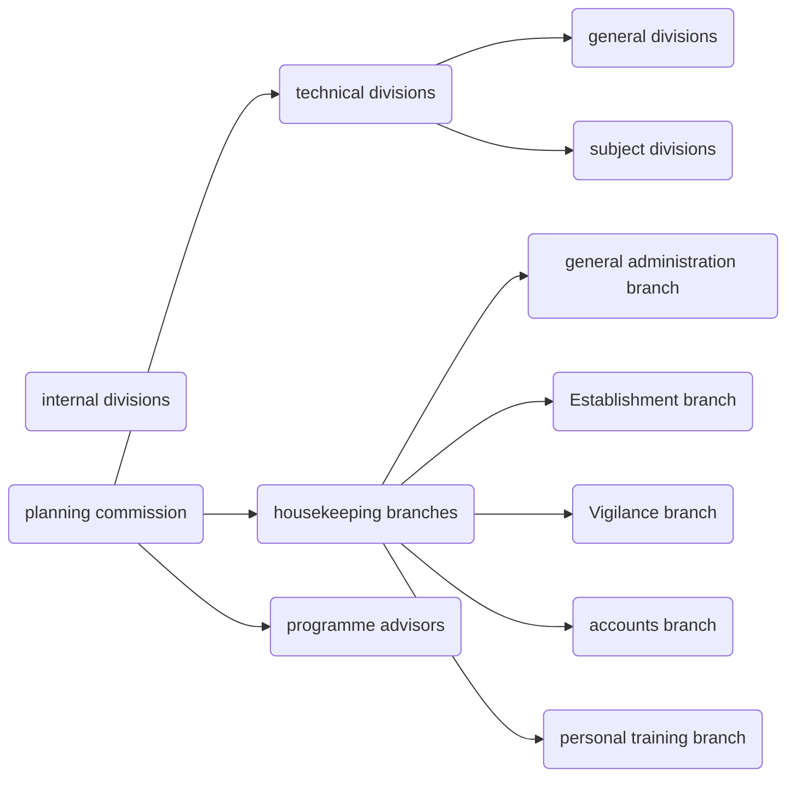

[[=polity laxmikant#part 8 - non-constitutional bodies]]
table of content
```toc
```

[[2022-02-24]] 19:14
[[1950]] [[planning commission]]
it is neither a constitutional body nor a statutory body
it is only an advisory body and has no executive power
it is a centre constituted body
[[prime minister]] is the chairman of the [[planning commission]]

[[PM wazir-i-azam]]
Planning Commission was originally established as a staff agency with advisory role but in the course of time it had emerged as a powerful and directive authority whereby its recommendations were considered both by the Union and states. The critics had described it as a ‘Super Cabinet’, an ‘Economic Cabinet’, a ‘Parallel Cabinet’, the ‘Fifth Wheel of the Coach’ and so on.
```query
"48. laxmikant - planning commission"
```