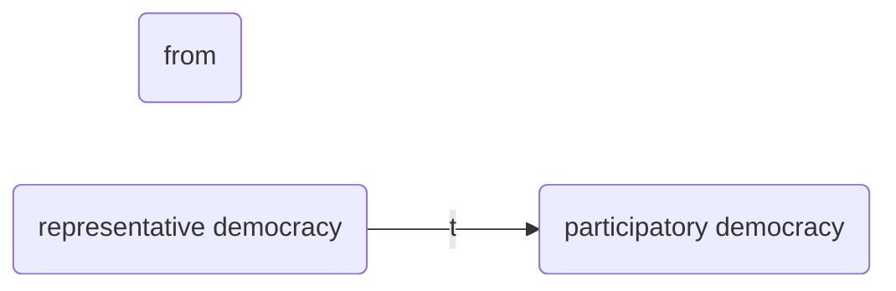

[[1 caa]] [[2 caa]] [[3 caa]] [[4 caa]] [[5 caa]] [[6 caa]] [[7 caa]] [[8 caa]] [[9 caa]] [[10 caa]] [[11 caa]] [[12 caa]] [[13 caa]] [[14 caa]] [[15 caa]] [[16 caa]] [[17 caa]] [[18 caa]] [[19 caa]] [[20 caa]]
[[21 caa]] [[22 caa]] [[23 caa]] [[24 caa]] [[25 caa]] [[26 caa]] [[27 caa]] [[28 caa]] [[29 caa]] [[30 caa]] [[31 caa]] [[32 caa]] [[33 caa]] [[34 caa]] [[35 caa]] [[36 caa]] [[37 caa]] [[38 caa]] [[39 caa]] [[40 caa]]
[[41 caa]] [[42 caa]] [[43 caa]] [[44 caa]] [[45 caa]] [[46 caa]] [[47 caa]] [[48 caa]] [[49 caa]] [[50 caa]] [[51 caa]] [[52 caa]] [[53 caa]] [[54 caa]] [[55 caa]] [[56 caa]] [[57 caa]] [[58 caa]] [[59 caa]] [[60 caa]]
[[61 caa]] [[62 caa]] [[63 caa]] [[64 caa]] [[65 caa]] [[66 caa]] [[67 caa]] [[68 caa]] [[69 caa]] [[70 caa]] [[71 caa]] [[72 caa]] [[73 caa]] [[74 caa]] [[75 caa]] [[76 caa]] [[77 caa]] [[78 caa]] [[79 caa]] [[80 caa]]
[[81 caa]] [[82 caa]] [[83 caa]] [[84 caa]] [[85 caa]] [[86 caa]] [[87 caa]] [[88 caa]] [[89 caa]] [[90 caa]] [[91 caa]] [[92 caa]] [[93 caa]] [[94 caa]] [[95 caa]] [[96 caa]] [[97 caa]] [[98 caa]] [[99 caa]] [[100 caa]]
[[101 CAA]] [[102 caa]] [[103 caa]] [[104 caa]] [[105 caa]] [[106 caa]]

[[70 caa]] [[71 caa]] [[72 caa]] [[73 caa]] [[74 caa]] [[75 caa]] [[76 caa]] [[77 caa]] [[78 caa]] [[79 caa]]

[[2022-03-17]] 01:54
- passed in [[1992]] & it came into effect on 24 April [[1993]].
- Due to this region, 24th April is celebrated as **Panchayati Raj Day** nationwide every year.
- Act added a new chapter into Constitution called 'Part 'X: Panchayats'.
- This Act added a new Schedule in constitution that is Schedule 11th & in this schedule 29 subjects were exclusively allocated to PRIs.
- This act inserted Article 243 to Article 2430 in Part IX of [[constitution]].
- [[reservation]] of seats for -
[[Scheduled Castes]], [[Scheduled tribes]]
- Women (including number of seats reserved for women belonging to SCS & STs).
- act authorizes legislature of a state to make any provision for reservation of seats in any Panchayat or offices of chairperson in panchayat at any level in favor of backward classes.

[[2022-03-01]] 00:21
- Granted constitutional status & protection to panchayati raj institutions. For this purpose, Amendment has added a new Part-IX entitled as ‘the panchayats’ & a new Eleventh Schedule containing 29 functional items of panchayats.

[[2022-02-14]] 11:48 [[1992]]
[[panchayat|panchayati raj]]
[[a243]] - a243 O
[[a40 Organisation of village panchayats]]

three tier system - panchayats at village, intermeiate & district levels
```query
"73 caa"
```