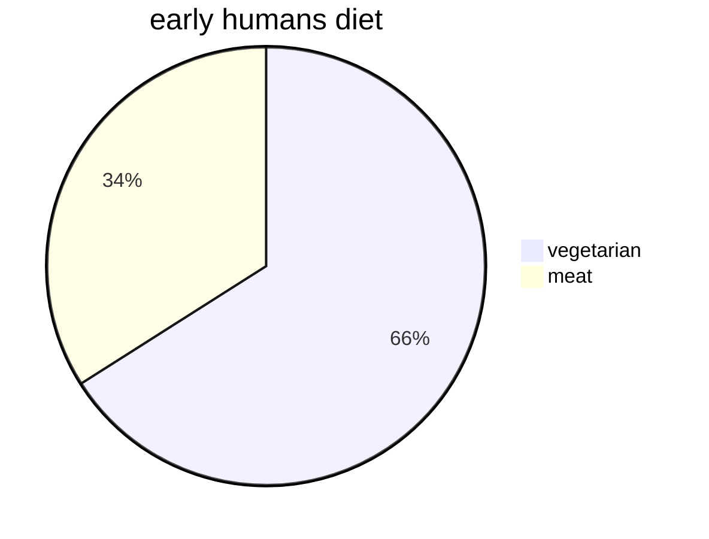

 
[[=anthropology v2]] [[=anthropology v3]] [[=anthropology v4]]
#qrcode

```qrcode
[Telegram: Contact @tkanthro](https://t.me/tkanthro/65)
```

pdf progr = 1-119-165—200-265-307–346
retake pdf pg
175, 181,187,222,,,,
[[2022-01-23]] 11:10
### INDEX
[[anthropology v1 meaning, scope and development of anthropology]]
#### relationship with other sciences
anthropology v1 anthropology and social sciences
[[anthropology v1 anthropology and behavioral sciences]]
[[anthropology v1 anthropology and medical sciences]]
#### main branches of anthropology
[[anthropology v1 socio-cultural anthropology]]
[[anthropology v1 biological anthropology]]
[[anthropology v1 archaeological anthropology]]
[[anthropology v1 linguistic anthropology]]
#### principles of prehistoric archaeology
anthropology v1 (A) chronology - relative and absolute dating metho that 
anthropology v1 (B) cultural evolution - palaeolithic culture
anthropology v1 (B) cultural evolution - mesolithic culture
anthropology v1 (B) cultural evolution - neolithic culture
anthropology v1 (B) cultural evolution - chalcolithic culture
anthropology v1 (B) cultural evolution - copper-bronze age
anthropology v1 (B) cultural evolution - iron age

#### nature of culture and society
anthropology v1 nature of culture
anthropology v1 nature of civilization
anthropology v1 ethnocentrism
anthropology v1 cultural relativism
anthropology v1 cultural relativism vs ethnocentrism
anthropology v1 nature of society
anthropology v1 society, culture and man
anthropology v1 social institutions
anthropology v1 social groups
anthropology v1 social stratification

#### marriage
anthropology v1 definition of marriage
anthropology v1 laws of marriage
anthropology v1 types and forms of marriage
anthropology v1 functions of marriage
anthropology v1 marriage payments

#### family
anthropology v1 definition and universality
anthropology v1 family, household and domestic groups
anthropology v1 types of families
anthropology v1 impact of urbanizatio’s  industrialization, education and feminist movements in the family
anthropology v1 universality of family - a critique

#### kinship
anthropology v1 consanguinity and affinity
anthropology v1 principles and types of descent
anthropology v1 forms of descent groups
anthropology v1 kinship terminology
anthropology v1 descent, filiation and complimentary filiation
anthropology v1 alliance and descent

#### economic organization
anthropology v1 meaning, scope and relevance of economic anthropology
anthropology v1 perspectives in economic anthropology
anthropology v1 formalism, substantivism and culturalism
anthropology v1 understanding small scale economies
anthropology v1 the forms and media of exchange
anthropology v1 principles of governing production, distribution and consumption in communities……
anthropology v1 principles of governing production, distribution and consumption in communities……food gathering economy
anthropology v1 principles of governing production, distribution and consumption in communities……hunting-fishing economy
anthropology v1 principles of governing production, distribution and consumption in communities……pastoral economy
anthropology v1 principles of governing production, distribution and consumption in communities……horticultural economy
anthropology v1 principles of governing production, distribution and consumption in communities……agricultural economy
anthropology v1 globalisation and indigenous economic systems

#### political organization and social control
anthropology v1 types of political organizations
anthropology v1 power, authority and legitimacy
anthropology v1 social control
anthropology v1 law and justice in simple societies

#### religion
anthropology v1 approaches to the study of religion
anthropology v1 monotheism and polytheism
anthropology v1 sacred and profane
anthropology v1 myths and rituals
anthropology v1 forms of religion in tribal and peasant societies
anthropology v1 magic
anthropology v1 religion, magic and science distinguished
anthropology v1 religious practitioners
anthropology v1 magic, witchcraft and sorcery

#### anthropological theories
anthropology v1 evolutionary school
anthropology v1 classical evolutionism
anthropology v1 historical particularism
anthropology v1 diffusionism
anthropology v1 functionalism
anthropology v1 structural functionalism
anthropology v1 structuralism
anthropology v1 culture and personality
anthropology v1 neo-evolutionism
anthropology v1 cultural materialism
anthropology v1 symbolic and interpretive theories
anthropology v1 cognitive anthropology and new ethnography
anthropology v1 post modernism

#### culture, language and communication
anthropology v1 nature of language
anthropology v1 characteristics of language
anthropology v1 origin of language
anthropology v1 verbal and non verbal communication
anthropology v1 social context of language use

#### research methods in anthropology
anthropology v1 fieldwork tradition in anthropology
anthropology v1 distinction between technique, method and methodology
anthropology v1 tools of data collection
anthropology v1 analysis, interpretation and presentation of data
# --–
actual content

[[2022-01-23]] 12:50 _related_ [[]] | [[]] | [[]] # # #
split between anthropology and society happened in [[19th century]]
anthropology is less abstract, more concrete
[[emics]] [[etic]]
every society has a characteristic personality
[[ruth benedict]] [[franz boas]] [[herbert spencer]]
anthropology uses holism as its trademark
charles winick
raciology
dermatoglyphics
kinanthropology
written history is only about 5000 years old (and only available for those cultures where writing was there)
[[geological time scale]]
[[pre cambrian era]]
[[cenozoic era]]
the way in which a group copes with and exploits the potentials of its environment is called its *system of cultural ecology*
palynology
**dating remains**
relative dating
absolute dating
stratigraphy
seriation
ages #pneumonic _SBI_
stone age
bronze age
iron age
towards the end of the iron age, people began to keep records thus ending million of years of prehistory
oldowan tradition
econiche


hominids began to assert control over their environment
natural selection favored best users of culture, smart hunter and tools users–> selection of a complex brain
major innovation - controlled use of fire for warmth and cooking
shelter became more important as cultural adaptation to the cold weather
*levallois* technique
the domestication of plants and animals allowed people to produce more food on a given area of land –> support more populations
### theories of the origin of agriculture
#### childe’s oasis model
gordon childe
#### braidwood’s nuclear zone theory
# --------------—
agriculture developed first in near east
### the near east
[[levant]]
[[mesopotamia]]n alluvium
[[iran|iranian]] plateau
steppe piedmont


yang-shao culture
### consequences of agriculture
increase in population
reduced [[mortality rate]]
during [[neolithic age]] life was about 31 years only !
social stratification
rise of the specialist class

chalcolithic culture
[[Fertile Crescent]]

copper-bronze age
associated with the domestication of [[horse]]

iron age
stated in the bible, philistines maintained a monopoly on iron working, keeping israelites in military inferit is the rity and economic dependance. a major objective of the hebrews’s prolonged wars with the philistines, recounted in the book of samuel, was to obtain the iron working technology - an aim achieved by the later time of king david

adiabatic vessels #doubt 

## the metal ages
for more than 99% of human history, society has been egalitarian
city, state and civilization
concentration of the [[surplus]] _related_ [[market surplus]] | [[civilization]]

from bands to states

government was a luxury provided by the surplus of agriculture

culture
culture is an attributr of the genus *homo*
## nature of culture
culture is a historically created design for living
unique to humans
non genetic, acquired

## attributes of culture
overtness and covertness
explicit and implicit
ideality and reality
ethos and eidos
ideality and reality
organic and inorganic
universal and unique

contra cultures

## nature of civilization
civilization is the advance stage of culture
written language
science
philosophy
division of labor
complex economy
political system

civilization needs culture even for its vital force and survival. the 2 are interdependent.
civilization cannot survive without strong stimulus and motive, however high maybe its achievements in science
while technology maybe a condition of the advancement of culture, it is not its fulfillment

artefacts - from culture
mentifacts - from civilization

cultural advance is the function of a creative minority

in groups and out groups

cultural relativism
[[society]] is an extension of individuality
[[1762]]
the need for self-preservation makes humans social

## groups
primary group
secondary group
reference group

there can be equality of opportunities but not of status
[[caste system|caste 制度]] would not have survived in india for centuries if the religious system had not made it sacred and inviolable
inqeuality in the estate system of europe was not primary economic but juristic #doubt 
agriculture is the oldest and most extensive employer of women

social stratification ensures the **circulation of elite**
malady of infinite aspiration
Fraternal Polyandry - https://www.youtube.com/watch?v=u7HKmu3eMEk

it is via [[marriage]] that society organizes sexual activities
## family
katherine allen (female) said
our assumptions, values, feelings and histories shape the scholarship we propose, the findings we generate, and the conclusions we draw
child’s social father - pater
child’s social mother - mater

the life of individuals past their prime is not always enviable even in these societies
large scale institutions are the unplanned result of individual desires and initiatives
in order to achieve the goal of placing everyone in his / her job solely on the basis of merit, we would have to destryo the family system entirely
#wo_de inheritance laws need to be revisited
in pre industrial society family was the production unit

women are less geographically mobile than men (on negative issues affecting them)
pdf pg 147, para2 last sentence -…… an old adage -  if this is the only roulette wheel in the town, men will continue to play even if it is honest and fair #doubt 

## descent
[[unilineal descent]]
[[phratry]]
[[patrilineal descent]]
[[matrilineal descent]]
[[advance unco-potestality]]
[[parallel descent]]
[[bilateral descent]]
cognatic descent
[[lineage]]
[[clan]]
[[moiety]]

complementary filiation
demographic hypothesis
sentiment hypothesis

## economic anthropology
formalism
substantivism
[[market]]s emerge where [[surplus]] exists
## agricultural economy
pdf pg 191, last para, … but non had the impact of the plough
[[wealth]] tends to follow [[power]]
## political organization and social control
acephalous #doubt 
cheifdoms
state
legitimacy enables a ruler to govern within a minimum of political resources.it is the soul of democracy
anomie #doubt 
folkways are followed unconsciously
an artist is an agent of civilization
civilization of any time can be judged by an examination of its [[art]]
human praise is the sweetest music
## religion
homo religiosus
the profane and the sacred
talcott parsons
a projection of the human mind
**stages in the thinking of humans**
theological or fictitious stage
metaphysical or abstract stage
scientific or positive stage
religion as a substitute for the death of biological father
one function is to bolster up the [[status quo]] the instill fear in those who challenge the authority
mysterium tremendum (a fearful mystery)
mysterium fascinana (a fascinating mystery)
the history of religion is a long attempt to reconcile old custom with new reason
emile durkheim - founder of the french school of sociology
franz boas - american ethnology
law of similarity
psychic unity of mankind
survivals

## historical particularism
[[franz boas]]
## diffusionism
**american school of diffusionism**
borrowing the traits from one culture group is easier at times than to invent them within one’s own culture
[[leo frobenius]]
[[fritz graebner]]
[[AC haddon]]
[[thor heyerdahl]]
[[AL kroeber]]
[[WHR rivers]]
[[father peter wilhelm schmidt]]
[[G elliot smith]]
[[EB tylor]]
[[clark wissler]]
## functionalism
[[functionalism]]
[[talcott parsons]]
### structural functionalism
## structuralism
### post structuralism
## culture the personality
[[ruth benedict]]
[[margaret mead]]
cognitive orientation to life and death
[[sigmund freud]]
[[edward sapir]]
[[ruth benedict]]
## neo evolutionism
parabolic curve theory
## cultural ecology
## cultural materialism
[[culture]] is primarily a mechanism of harnessing energy and of putting it to work in service of humans
culture is an **extra somatic temporal continuum**
the level and complexity of culture depends on the capacity of culture to capture and utilize [[energy]]
[[law of cultural development]]
evolution is a temporal continuum
historical studies are particularizing while evolutionary studies are generalizing
## cognitive anthropology
## post modernism
## culture, language and communication
the infinite productivity and creativity of language
displaced reference - the ability to communicate about things outside immediate temporal and spatial contiguity
brains and knowledge are what create the prosperity and growth we tend to take for granted.
lying hypothesis - language developed so as to conceal true intentions !
history is entirely a resulate  of language
[[buddhism#^38ba09]]
objectivity is the greatest asset of a scientist
it is never safe to take published statistics at their face value without knowing their meaning and limitations
```query
"anthropology v1"
```