[[=anthropology v1]] [[=anthropology v3]] [[=anthropology v4]]
#qrcode

```qrcode
[Telegram: Contact @tkanthro](https://t.me/tkanthro/66)
```
# progress 252/284
1-54-74-205-228-252-284

[[2022-01-27]] 12:54 _related_ [[]] | [[]] | [[]] # # #

## human evolution and emergence of man
### biological and cultural factors in human evolution
hominization process
by the time of [[Homo erectus]], all the human traits were there
human gave up the usage of tooth as *fifth hand*
the importance of tools as molders of human evolution
try carrying a brick around with you for a day (to realize the commitment hominids have to use their tools regularly)
**major themes of human evolution**
erect [[bipedalism]]
reduction of face
expansion and development of [[brain]]
[[400 Language]]
### theories of organic evolution
[[herbert spencer]]
[[charles darwin]]
descent with modification
the concep of change is inherent in [[evolution]]
#wo_de evolution does not explain how the change arises ?
#### pre- darwinian phase
[[theophrastus]]
[[mendel]]
[[lamarckism]]
#### the darwinian phase
theory of natural selection
[[alfred russell wallace]]
[[1858]]
[[=origin of species book]] [[charles darwin]] [[1859]]
**darwin’s propositions -** 
continuous trial and error on a gigantic scale
universal occurrent of variations
excessive natural rate of multiplication
struggle for existence
survival of the fittest
inheritance of variation
#### theory of natural selection (darwinism)
#### post-darwinian phase
[[hardy weinberg principle]]
extinction is the rule not the norm in evolution
### synthetic theory of evolution
#### basic concepts and terms in evolutionary biology
#### convergence
#### parallelism
#### homology and analogy
#### adaptive radiation
[[dollo’s law]]
#### mosaic evolution - the evolution of plants and wholes
[[bipedalism]] preceded [[encephalization]]
#### cope’s rule
[[cope’s rule]]
#### principle of competitive exclusion or gause’s rule
[[gause's rule]]
## characteristics of primates
#### primates evolutionary trends
many of human’s characteristics are simply a refinement of a basic primate pattern that evolved million of years ago in response to the necessities of arboreal living
behavioral flexibility has taken place of bodily specializations in primates _related_ [[nanotechnology]] | [[technology|ironman]] | [[tony stark]]
increased intelligence, advanced brains, better maternal care go together in the mammals and especially in the primates

```mermaid 2022-01-27 - 16:46
graph TB
style a fill:#000
style b fill:#000
style c fill:#000
style d fill:#000
style e fill:#000
style f fill:#000
style g fill:#000
style h fill:#000
a(emphasis)-->b(hands)
a(emphasis)-->c(eyes)
a(emphasis)-->d(brains)

e(deemphasis)-->f(nose)
e(deemphasis)-->g(teeth)
e(deemphasis)-->h(face)
```

#### primate taxonomy and behavior
[[mammals]] invest a great deal of time and energy in their [[offspring]]
[[platypus]] is the only mammal that is poisnous
[[1758]]

```mermaid 2022-01-27 - 16:52
graph TB
style a fill:#000
style b fill:#000
%% style fill:#000
%% style fill:#000
%% style fill:#000
%% style fill:#000

a(primates)-->b(prosimil)
a(primates)-->c(anthropoidea)

c-->d(platyrrhini)
c-->e(catarrhini)

e-->f(cercopithecoidea)
e-->g(hominoidea)

g-->h(hylobatidae)
g-->i(pongidae)
g-->j(hominidae)
```

#### tertiary and quaternary fossil primates
#### a comparative anatomy of man and apes
relative lightness is one of the unique features of humans
[[bipedalism]]
**geological timescale during cenozoic** [[cenozoic era]]
	[[pleistocene]]
	[[pliocene]]
	[[miocene]]
	[[oligocene]]
	[[eocene]]
	[[palaeocene]]
[[prognathism]] of the lower jaw is sometimes observed in human
#### primate adaptations - arboreal and late terrestrial
#### skeletal changes dueo to bipedalism and their implications
[[arthritis]] [[bipedalism#^0dc0bf]]
## phylogenetic status, characteristic, and distribution of human fossil ancestors
[[ramapithecus]]
#### plio pleistocene hominids in south and east africa - australopithecines
[[australopithecus]]
[[paranthropus]]
[[homo habilis]]
punctuated equilibrium
#### homo erectus
[[Homo erectus]]
mount carmelite
#### homo erectus heidelbergensis
#### neanderthal man
[[homo neandertalensis]]
#### rhodesian man
[[rhodesian man]]
#### homo sapiens
[[homo sapiens]]
	[[cro magnon man]]
	[[grimaldi man]]
	[[chancelade man]]
## the biological basis of life
the cell
DNA structure
DNA replication
protein synthesis
gene mutation
chromosomes
cell division
## human genetics - methods and applications
pedigree analysis
the twin method
co twin method
foster child
cytogenetic method
chromosomal and karyotype analysis
biochemical methods
immunological method
recombinant DNA technology
## mendelian genetics in man
the mendelian principles
single factor, multi factor and polugenic inheritance in man
lethal gene action
## concept of genetic polymorphism and selection
genetic polymorphism and selection
mendelian population
genetic equilibrium
hardy-weinberg equilibrium
causes and changes in gene frequency
consanguineous and non-consanguineous mating
genelic load
genetic effects of consanguineous and cousin marriages
## chromosomes and chromosomal aberrations in man
numerical and structural aberrations
sex chromosomal aberrations
autosomal aberrations
genetic imprints in human diseases
genetic screening
genetic councelling
human DNA profiling
gene mapping and genome study
## race and racism
#### race and racism
#### biological basis of morphological variation of non metric and metric characters
stature
according to bergmann, smaller size population inhabits warmer parts and vice versa
people living in cold climates have higher, narrower noses than warmer ones
modern people are characterised by [[orthognathism]]
[[bergmann’s  rule]]
#### serological and genetic criteria
#### racial criteria racial traits in relation to heredity and environment
#### racial classification and differentiation
## age, sex and population variation
## concepts and methods of ecological anthropology
#### bio-cultural adaptations - genetic and non genetic factors
#### man’s physiological responses to environmental stresses
human’s culture producing capacity has aided a lot in adaptation
appetency
relative energetic efficiency as an indication of the adequacy of a [[technology]]
hot deserts
cold high altitude climates
## epidemiological anthropology
common cold is caused by [[virus]] not cold — [[temperature]]
#### concept of epidemiological anthropology
#### health and disease
#### infectious and non infectious diseases
#### infectious diseases
#### nutritional deficiency related diseases
## concept of human growth and development
#### concept of human growth and development
#### stages of human growth
##### prenatal development
##### infancy
##### childhood
##### adolescence
adolescence begins in biology and ends in culture
##### maturity
##### senescence
#### factors affecting growth and development
#### ageing and senescence
##### biological and chronological longevity
##### theories and observations
#### human physique and somatotypes
#### methodologies for growth studies
## social demography
#### relevance of menarche, menopause and other bioevents to fertility
#### fertility patterns and  differentials
#### demographic theories - biological, social and cultural
#### biological and social ecological  factors influencing fecundity, fertility, natality and mortality
## applications of anthropology
#### anthropology of sports
#### nutritional anthropology
#### designing of defense and other equipments
#### forensic anthropology, methods and principles of personal identification and reconstruction
#### applied human genetics
#### paternity diagnosis
#### genetic counselling
#### eugenics
#### DNA technology in diseases and medicine
```query
"=anthropology v2"
```