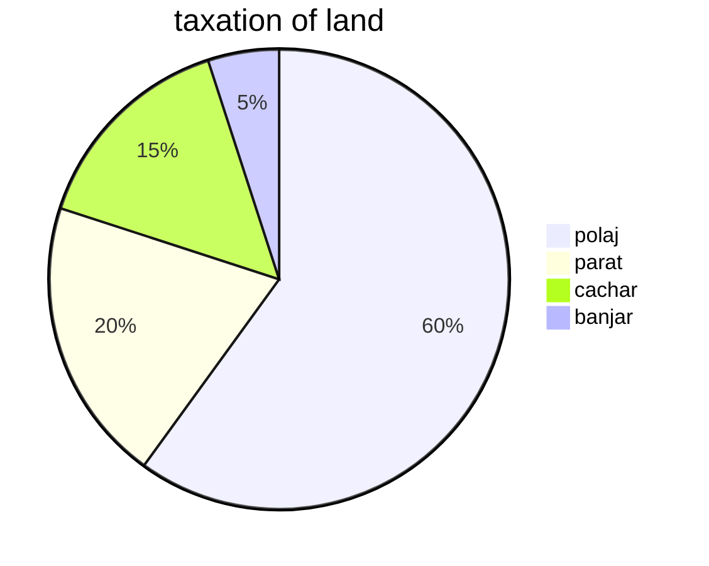

🔖 - . ,. ,
[[ancient and medieval history c1]] [[ancient and medieval history c2]] [[ancient and medieval history c3]] [[ancient and medieval history c4]]
[[ancient and medieval history c5]] [[ancient and medieval history c6]] [[ancient and medieval history c7]] [[ancient and medieval history c8]]
[[ancient and medieval history c9]] [[ancient and medieval history c10]] [[ancient and medieval history c11]] [[ancient and medieval history c12]]
[[ancient and medieval history c13]] [[ancient and medieval history c14]] [[ancient and medieval history c15]]
媽媽 note (if any) - 

`1. revision - 08:43 pm 13/10/2021`
`2. revision - 07:54 pm 14/10/2021`
`3. revision - 11:42 pm 21/10/2021`
`4. revision - 11:06 m 23/11/2021` [[2021-11-23]]
`5. revision - `
		
`18:48 和 2021-10-12` mughals (continued) (01:06 pm)
# humayun
- (1530-40) [[humayun#humayun 1st phase]]
# sur empire
(1540 ad-1555 ad) (01:16 pm) [[sur empire]]
## sher shah suri
(1540-45 ad)
- [[sher shah suri]]
# humayun: 2nd phase
(01:35 pm)
- [[humayun#humayun 2nd phase]]
# akbar
(1556-1605) (01:52 pm)
- [[akbar]]
 # administration during akbar's period
(02:18 pm)
[[akbar#administration during akbar's period]]
# mansabdari system
(02:25 pm)
- [[mansab]] [[mansabdar]]
- [[mansabdari system#古 和 med 印度 class 14]]
# economic initiatives during akbar
(02:51 pm)
[[akbar#economic initiatives during akbar]]



# socio-religious initiatives of akbar
[[akbar#socio-religious initiatives of akbar]]
# jahangir
(1605-1627) (03:42 pm)
- [[jahangir#古 和 med 印度 class 14]]

topic for next class: mughals continued & remaining part.
# recommended readings
```query 2022-03-28 18:15
"ancient & medieval history c14"
```