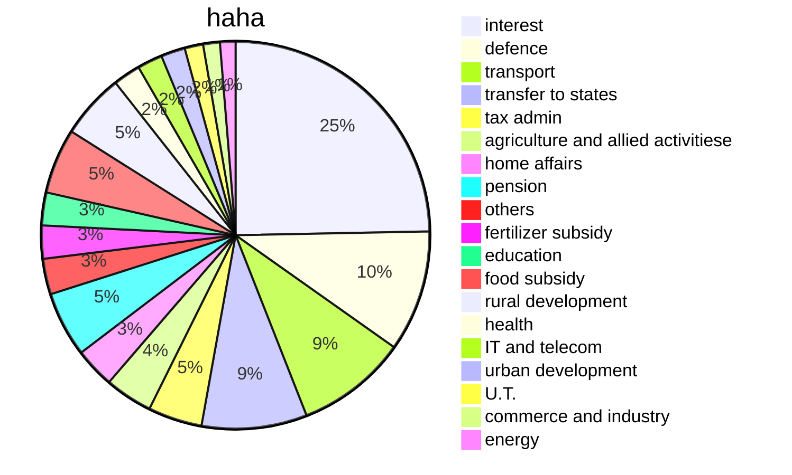

 ```qrcode
 [budget 2022](https://t.me/tkeconomics/31)
 ```
 
[[2022-02-02]] 19:03 _related_ [[]] | [[]] | [[]] # # #
[Union Budget 2022 - Full analysis of Union Budget 2022 by Ankit Agrawal | Budget 2022 | UPSC Exams - YouTube](https://www.youtube.com/watch?v=DdJ2Px_CPKg)
[[a226 Power of High Courts to issue certain writs]]
[[a112 Annual financial statement]] - [[a117]] = deals with the financial matters

[[2022-02-16]] 14:02 [[]] [[]] [[]]
capacity augmentation
![[2022#^a1d0a9]]




Unique Land Parcel Identification Number for IT-based management of land records.
sunrise sectors
![[2030#^bd315c]]
digital rupee
Total expenditure in 2022-23 estimated at Rs. 39.45 lakh crore
Fiscal deficit in 2022-23.stimated at 6.4% of GDP
total receipts other than borrowings in 2022-23 estimated at Rs 22.84 lakh crore
```query
"budget 2022"
```