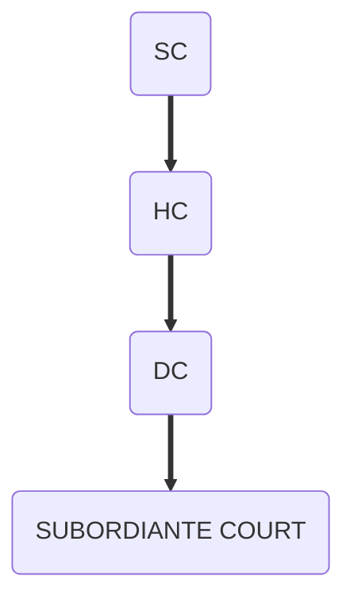

- appointment ˋ judges
	- As far as the appointment of the Chief Justice of India (CJI) is concerned, over the years, a convention had developed whereby the senior-most judge of the Supreme Court was appointed as the Chief Justice of India. This convention was however broken twice. In 1973 A. N. Ray was appointed as CJI superseding three senior Judges. Again, Justice M.H. Beg was appointed superseding Justice H.R. Khanna (1975)
- [[collegiality]]
- removal ˋ judges
	- a motion 有 د charges 反 د judge must be approved 被 د [[special majority]] בּ houses 的 د parliament

- [[simple majority]]

- unsuccessful attempt  ݈  remove a judge
	- justice V. ramaswamy 1991 [[cold war]]

# str 的 د [[judiciary]]
- ![[str 的 د judiciary.png]]

- jurisdiction ˋ 大法官 ˋ 印度
	- original jurisdiction
		- settles disputes 中 union 和 states 和 amongst states
	- [[writs]] jurisdiction
		- 能 issue them ݈ protect د [[fundamental rights]] 的 د 个人
	- appellate jurisdiction
		- tries appeals من lower courts 里 civil, criminal 和 宪法al cases
	- advisory jurisdiction
		- advises د president on matters ˋ public iportance 和 法 
	
- [[supreme court]] 能 issue [[writs]] 
- special 力s
- [[a137]]
- [[a144]]