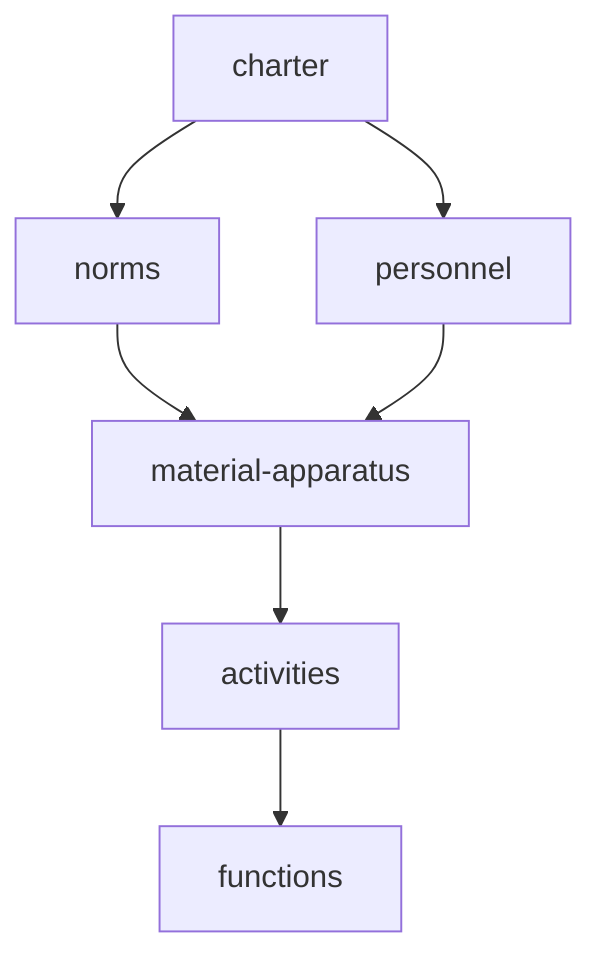

 ---
alias: [2022-02-03,16:54]
---
 mother [[=anthropology v4]] [[]]
 related [[malinowski]] [[]]
 `contemporary events` [[]] [[]] [[]] [[]] [[]] [[]] [[]] [[]]

[[2022-02-03]] 16:54 _related_ [[]] | [[]] | [[]] # # #
[[malinowski]]


human life is lived in a society and is characterized by cooperation and interdependence
[[malinowski]] analyzed culture as an instrument for satisfying basic and derivative human needs

```query
"cultural functionalism"
```