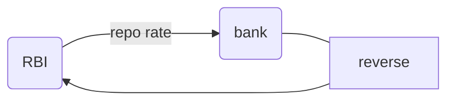

[[economics 01]] [[economics 02]] [[economics 03]] [[economics 4]] [[economics 5]] [[economics 6]] [[economics 07]] [[economics 08]] [[economics 09]] [[economics 10]]
[[economics 11]] [[economics 12]] [[economics 13]] [[economics 14]] [[economics 15]] [[economics 16]] [[economics 17]] [[economics 18]] [[economics 19]] [[economics 20]]
[[economics 21]] [[economics 22]] [[economics 23]] [[economics 24]] [[economics 25]] [[economics 26]] [[economics 27]] [[economics 28]] [[economics 29]] [[economics 30]]
[[economics 31]] [[economics 32]] [[economics 33]] [[economics 34]] [[economics 35]] [[economics 36]] [[economics 37]] [[economics 38]] [[economics 39]] [[economics 40]]
[[economics 41]] [[economics 42]] [[economics 43]] [[economics 44]] [[economics 45]] [[economics 46]] [[economics 47]] [[economics 48]]
table of content
```toc
```
[[2022-03-01]] 12:38
## control of [[money]] [[supply]]
[9:15 am]
- [[rbi]] controls amount of [[money]] circulating in [[economy]] by looking at various objectives. 2 broad objectives that [[rbi]] desires to meet for conduct of [[monetary policy]] are [[growth]] & [[inflation]].
- in order to facilitate growth or control prices, [[rbi]] increases or decreases [[money]] [[supply]].
- to control [[money]] [[supply]] [[rbi]] has various [[tool]]s which can be categorized as quantitative & qualitative.
- any tool that [[rbi]] has, essentially, influences either [[money multiplier]] or high-powered [[money]], either directly or indirectly.
## quantitative tools
### cash reserve ratio
- [[cash reserve ratio]] (crr)
- banks have to maintain some proportion of their NDTL (net [[demand]] & time liabilities) with [[rbi]] in form of cash.
- this is a regulatory requirement to keep certain reserves with [[rbi]] & *earns no interest to banks*.
- CRR directly influences [[money multiplier]] process-an increase in crr will reduce lendable deposits with bank & therefore multiplier process will come to halt quickly.
- 结论 (conclusion) jie2lun4 = CRR more, money less
- *inverse relation between [[money]] [[supply]] & crr*
### statutory liquidity ratio
[[statutory liquidity ratio]] (slr)
banks have to maintain some proportion of their NDTL (net [[demand]] & time liabilities) with themselves (and not with rbi) in form of designated liquid assets such as [[cash]], [[gold]], [[[[government]]]] bonds, designated corporate bonds etc.
SLR is meant to increase reserve with banks themselves in a manner that banks can also earn some interest on this proportion of deposits while maintaining these reserves in liquid form- i.e. they can be liquidated when required.
SLR also influences m ([[money multiplier]]) directly-an increase in SLR will reduce [[money]] multiplier, as lendable deposits with banks will reduce, & thus multiplier process will come to a halt soon.
### OMO open market operations
[[open market operations]] (OMOs)
when [[rbi]] enters market directly & is involved in direct buying & selling of assets, such a situation is called OMOs.
by conducting omos [[rbi]] increases or decreases high-powered [[money]].
therefore [[money]] [[supply]] is changed due to changes in m0.
when [[rbi]] buys assets from market it increases m0, whereas on selling assets in market, it reduces liquidity by reducing m0.
### LAF liquidity adjustment facility
[[liquidity adjustment facility]] LAF [10:03 am]

it is tool of monetary policy that controls [[money]] [[supply]] by influencing interest rates.
if interest rates at which [[money]] is lent increase, then there would be lesser [[demand]] for credit in [[economy]]. & therefore less [[money]] would be lent & thus spent. [[money supply]] would reduce.
on other hand, if rate at which [[money]] is lent decreases, there would be greater [[demand]] for credit & hence [[money]] [[supply]] will increase.

*LAF influences interest rates in foll manner -*
[[demand]] for [[credit]] is independent of amount of deposits with [[bank]].
obviously, amount of credit & deposits affect bank’s capability to either lend or to pay interest to its depositor.
still, both sides that are deposits & credit are independent of each other.
it may happen that number of deposits with bank is greater than amount of loan required by economy or vice versa, credit [[demand]] may be greater than amount of deposits.

[[rbi]] being **banker of banks** is that entity to which banks can approach for borrowing or lending [[money]]. [[rbi]] lends [[money]] to bank in case there is excess credit [[demand]] at an interest rate called [[repo rate]].
this lending is to correct temporary mismatches in banks liquidity [[rbi]] lends [[money]] to banks only for a not termed duration i.e on a daily, weekly or fortnightly basis.
this [[money]] is lent in secured manner i.e. banks pledge govt securities with rbi, & agree to repurchase them within said [[time]].
[[repo rate]] is charged on this facility of [[liquidity]] adjustment by [[rbi]] from banks.
conversely, banks lend [[money]] to [[rbi]] & charge a [[reverse repo rate]] (RRR), i.e. [[rbi]] pays RRR when it borrows [[money]] from a bank for a short-term basis.

### bank rate
- [[bank rate]] [11:38 am]
- #extinct bank rate was rate at which [[rbi]] used to lend [[money]] to banks for a longer duration. this practice stopped in early [[2000]]. & since then bank rate has been retired. it is now aligned to penal rate i.e. msf rate.

### MSF marginal standing facility
- [[marginal standing facility]] (msf)
- facility gave to a [[bank]] to borrow [[money]] from [[rbi]] by compromising on their SLR commitments.
- since [[money]] is borrowed by violating SLR requirement, there is a penalty that banks have to pay in order to borrow more [[money]].
- LAF borrowing requires [[government]] securities. in fact, any borrowing from [[rbi]] is a secured loan i.e. it needs some security to be paid to [[RBI]] in order to borrow from RBI.
- banks use [[government]] securities that they possess in order to borrow from RBI.
- in case, banks run out of their [[government]] securities, they can take recourse to [[government]] securities kept with them in compliance of SLR regulations.
- RBI allows [[bank]]s to reduce their SLR commitment by a maximum of 1% points & thus use [[government]] securities freed up in process to borrow from rbi.
- since banks are in violation of their SLR commitment they pay a penalty to borrow [[money]] from [[rbi]] using such freed-up securities.
- penalty is in form of a higher than repo [[interest rate]] that banks have to pay to rbi. this is called MSF rate & is usually 0.5 - 1% points higher than [[repo rate]].

qualitative tools [11:59 am]

a brief discussion on selective credit control & moral suasion

 topic of next class: priority sector lending
```query
"economics 29"
```