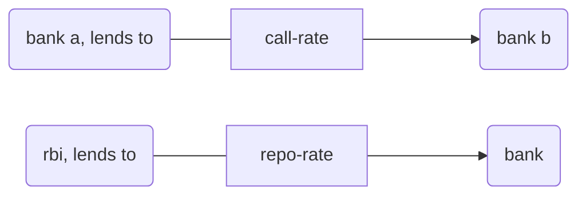

[[economics 01]] [[economics 02]] [[economics 03]] [[economics 4]] [[economics 5]] [[economics 6]] [[economics 07]] [[economics 08]] [[economics 09]] [[economics 10]]
[[economics 11]] [[economics 12]] [[economics 13]] [[economics 14]] [[economics 15]] [[economics 16]] [[economics 17]] [[economics 18]] [[economics 19]] [[economics 20]]
[[economics 21]] [[economics 22]] [[economics 23]] [[economics 24]] [[economics 25]] [[economics 26]] [[economics 27]] [[economics 28]] [[economics 29]] [[economics 30]]
[[economics 31]] [[economics 32]] [[economics 33]] [[economics 34]] [[economics 35]] [[economics 36]] [[economics 37]] [[economics 38]] [[economics 39]] [[economics 40]]
[[economics 41]] [[economics 42]] [[economics 43]] [[economics 44]] [[economics 45]] [[economics 46]] [[economics 47]] [[economics 48]]
table of content
```toc
```

[[2022-03-01]] 15:19
note - interest rates in our country are regulated i.e. rbi does not dictate what interest rate should bank offer to its depositors or charge from borrowers.
## external benchmarking
[[external benchmarking]]
- external benchmarking refers to process under which banks are required to use certain external interest rates as their variable costs.
- term ‘external’ means outside banks.
- rbi came up with list of some external benchmarks such as [[repo rate]], mibor (mumbai interbank offered rate); it's [[call rate]]; (call rate is rate at which banks lend money to each other), yield on 10 years [[government]] security, etc.
- by using these external benchmarks, mclral is sought to be made more sensitive to policy rate & therefore transmission can be improved.

## unconventional tools of monetary policy
[9:45 am]

### quantitative easing
- [[quantitative easing]] qe
- QE is bond buying program of american federal reserve under which it increased [[money supply]] in american [[economy]] exponentially through [[open market operations]].
- this was done so that banks would get [[money]] & lend this to individuals & other riskier entities.
- post-[[2008]] financial crisis, there was complete lack of trust in financial system & banks were reluctant to lend any money to anyone.
- they would invest all their money in [[government bond]]s or highly secure corporate bonds.
- to nudge banks into lending money, [[federal reserve]] purchased almost all government & secured corporate bonds from banks & thereby leaving them with cash so that this could be lent to [[economy]].
- federal reserve had target of 2% [[inflation]] which would be objective sign of [[demand]] returning to [[economy]].
- this was target used to measure success of QE & signal that went QE had to be reduced.
- fed would then taper bond buying accordingly.

### market sterilization scheme
- [[market sterilization scheme]] mss
- [11:12 am]
- policies such as quantitative easing result in too much foreign money being poured into indian economy.
- this causes unanticipated increase in money supply. for example- a, foreign investor brings 10 billion dollars to india. to use them he would have to convert them into rupees at bank branch.
- bank gives rupees & takes dollars. bank has little use of this dollar & thus takes them to [[rbi]] & exchanges these dollars for rupees. this causes increase in [[money supply]].
- to absorb this excess money supply created out of inflow of [[dollar]]s rbi sells special bonds c/a mss bonds on behalf of government in economy to sterilize or absorb this excess money.

## banking
[11:30 am]
- reserve bank of india
- established under [[rbi act 1934]] [[1934]]
- perform task of regulation under -
	- [[banking regulation act 1948]] [[1948]]
	- [[companies act 2013]] [[2013]]
- rbi grants licenses on basis of “on tap licenses policy”
### types of bank
- universal vs diffiated
- universal banking- carry out all types of activities [[bank]] can do.
- rbi also provides diffiated licensing (only certain activities/operations bank is allowed to do)
- ex of diffiated bank- small financial bank (sfbs) & payment banks

- sfbs are *small in size of operation; not small in are of operation*; can effectively perform almost everything as universal bank but on smaller scale. largely caters to those people whose size bank deposits & borrowings from banks are small.

- [[payment bank]]s- specialized in facilitating payment
- take deposits & help in transferring money.
- payment banks can not lend money.
- *it cannot issue credit cards (not allowed to give loans)*

[[wholesale bank]]- caters to big customers.
[[merchant bank]]s performs tasks of wholesale banks #doubt 
[[investment bank]]- perform task of investment

[[custodian bank]]-
- takes custody of assets
- scheduled vs non-scheduled
- names of banks are written under 2nd schedule of banking regulation act 1948, c/a scheduled banks;
- highly compliant to rbi; gets wider facilities from rbi
- schedule banks could be commercial or cooperative
commercial vs cooperative
	[[commercial bank]]s - objective is to earn [[profit]]
	[[cooperative bank]] - pooled money is lent to depositors; 1st registers into “cooperative society registration act” under state government. thereafter, may get banking licensing from rbi.
- all cooperative societies are registered under “registrar of cooperative society”.

topic of next class: banking, financial inclusion to be continued
```query 
"economics 31"
```