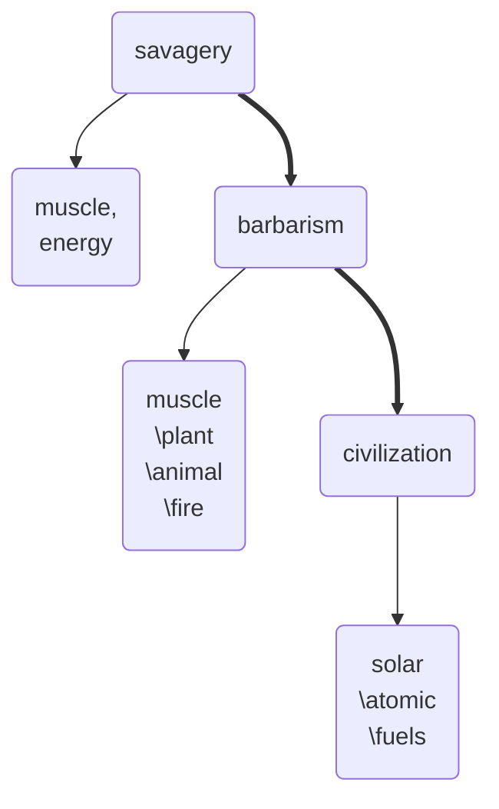

 mother [[]] [[]]
 related [[]] [[]]
 `contemporary events` [[]] [[]] [[]] [[]] [[]] [[]] [[]] [[]]

[[2022-02-03]] 21:35 _related_ [[]] | [[]] | [[]] # # #
Culture evolves in proportion to the increased output of energy on the part of each individual, or to increase the efficiency with which the energy is put to working
$$culture =energy\times technology$$


```query
"energy theory of culture"
```