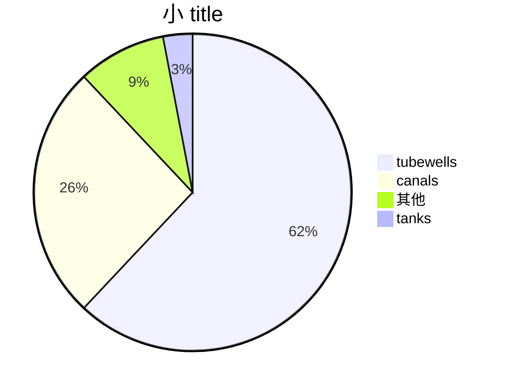

- process 的 supplying 水 to crops 被 人造的  means (canals, tube wells, tanks, etc) 叫  د  د  د  د 
-  它 ↓ our dependence on nature 和 provides an 人造的  egularity 里 د human affairs [[=book guns, germs and steel]] [[yuval noah harari]] [[gregorian calendar]]

- benefits 的 它 -
	- ↑ 里 crop yield
	- protection من famine
	- 新 areas _ cultivation
	- cultivation 的 superior crops
		- with assured supply of water for irrigation, farmers [[may]] think of cultivating superior variety of crops or even other crops which yield high return.
	- elimination 的 mixed cropping
	- [[_economics 经济 MOC]]ic [[development]] 
	- hydro 力 生
	- domestic 和 industrial 水 supply

```query 2021-12-31 00:34
"irrigation"
```



- [[老师 ojha 历史 课 tk]]

- ![[Pasted image 20210705002310.png]]

```query
"irrigation"
```