 mother [[]] [[]]
 related [[]] [[]]
 `contemporary events` [[]] [[]] [[]] [[]] [[]] [[]] [[]] [[]]

[[2022-01-16]] 09:58 _related_ [[]] | [[]] | [[]] # # #
### official mermaid site
https://mermaid-js.github.io/mermaid/#/flowchart

### declare multiple nodes links in the same line 
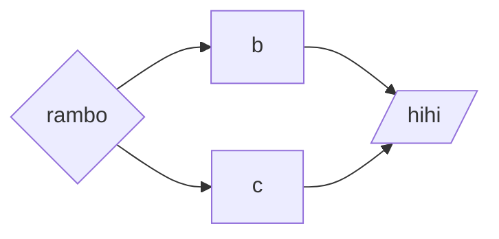
### 
```mermaid

```


# -------------------
- https://www.mishacreatrix.com/knowledge-management-flow-diagram-in-obsidian
;mermaid gantt
```mermaid
gantt
    dateFormat  HH-mm
    axisFormat %H:%M
    %% Current Time: 10:27:15 PM
    section Tasks
    Setup for work     :09-30, 15mm
    Review notes من yesterday     :09-45, 45mm
    Create 新 notes for #35;article review     :10-30, 60mm
    哈哈哈     :12-30, -30mm
    making notes     :12-00, 25mm
    Reading     :12-30, 90mm
    section Breaks
    BREAK     :11-30, 60mm
    BREAK     :12-25, 5mm
    BREAK     :14-00, 0mm
```

- https://www.diagrams.net/  = to make diagrams online
# gantt chart 09:39 AM 26/6/2021
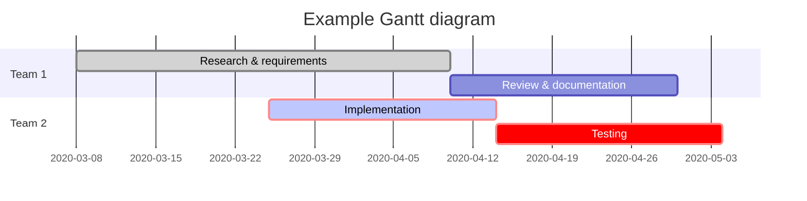


- 09:36 AM 26/6/2021
### pie chart
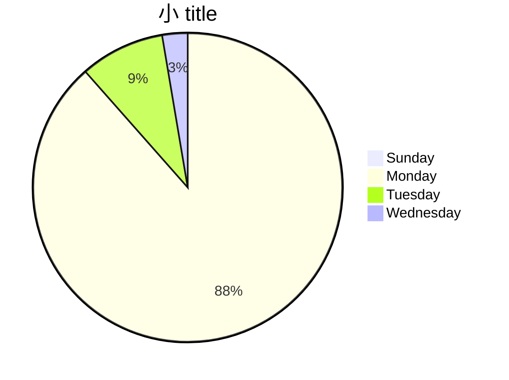

- [[obsidian learning]]
pie chart 里 mermaid programming language
https://www.youtube.com/watch?v=rXhUeV5Ko7g


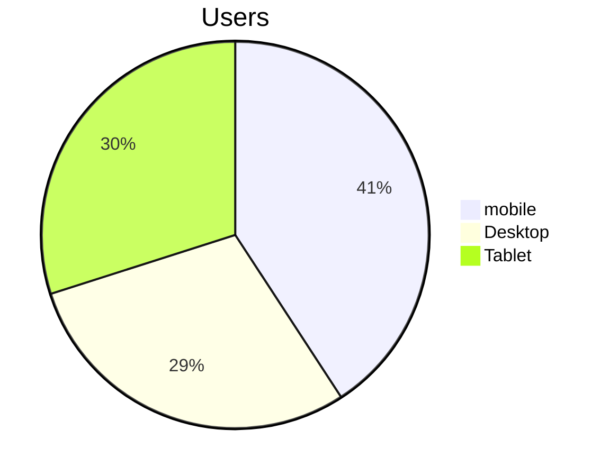

### top to bottom
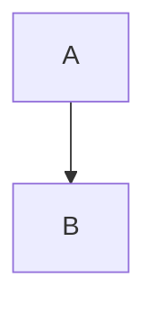

;openlink
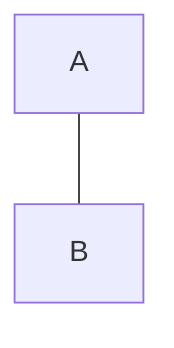

### left to right
;text on link
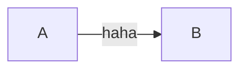

### dotted line arrow
;dotted link
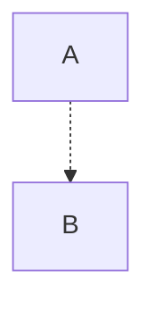

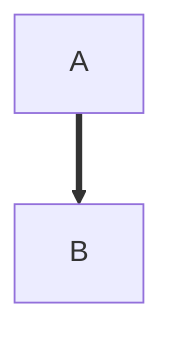


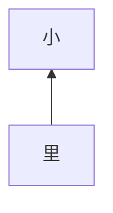

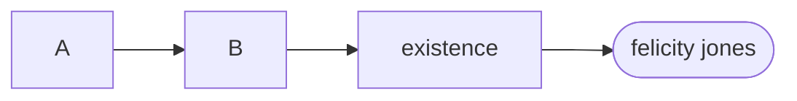

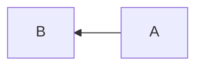


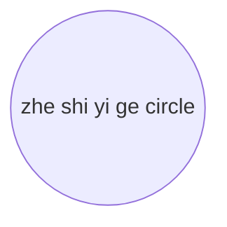
### circle
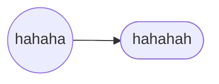


### trophy ribbon
;assymmetrical


### rhombus
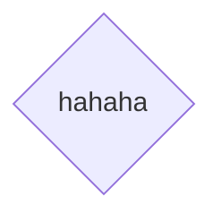

### hexagon
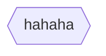


### parallelogram
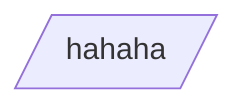

```query 2022-01-16 09:54
"mermaid programming obsidian syntax language"
```
