 mother [[]] [[]]
 related [[]] [[]]
 `contemporary events` [[]] [[]] [[]] [[]] [[]] [[]] [[]] [[]]

[[2022-01-17]] 21:05 _related_ [[]] | [[]] | [[]] # # #

```mermaid
graph TB
%% this is a comment

%% prenatal period
style 1 fill:#000
style 2 fill:#000
style 3 fill:#000
1(ovum)--> |0-14 days|2(embryo)-->|14 days-9 weeks|3(foetus)

%%postnatal period
style a fill:#000
style b fill:#000
style c fill:#000
style d fill:#000
style e fill:#000
style f fill:#000
style g fill:#000
style h fill:#000
style i fill:#000
a(newborn)-->|first 4 weeks after birth|b(infancy)-->c(toddler)-->d(preschool-child)-->e(school-age)-->f(adolescence)-->g(adulthood)-->h(mature)-->i(senescent)

```


### longitudinal growth study
height reaches maximum at [[16]] years of age
**laws of growth**
*orderliness*
growth follows a sigma shaped curve
*growth gradient*
cephalocaudal and distal to proximal
**growth-curves**
```query
"physical anthropology part C ch1 growth and development - concept"
```