 mother [[]] [[]]
 related [[]] [[]]
 `contemporary events` [[]] [[]] [[]] [[]] [[]] [[]] [[]] [[]]

[[2022-01-18]] 14:38 _related_ [[]] | [[]] | [[]] # # #

```mermaid 2022-01-18 - 14:44
graph TB
style a fill:#000
style b fill:#000
style c fill:#000
style d fill:#000
style e fill:#000
style f fill:#000
style g fill:#000
a(pituitary gland)-->b(FSH)
a(pituitary gland)-->c(LH)

%% under FSH
b-->d(females - dvlp of ovarian<br> follicle, oestrogen<br> secr. & sec sex char)
b-->e(males - spermatogenesis,<br> ertoli cells growth<br> of testes, etc)

%% under LH
c-->f(in feml<br> ovulation)
c-->g(in mls - stimulation<br> of leydig's cells<br>, testesterone<br> & sec sex char)
```


```query
"physical anthropology part C ch8 biochemical factors of growth"
```