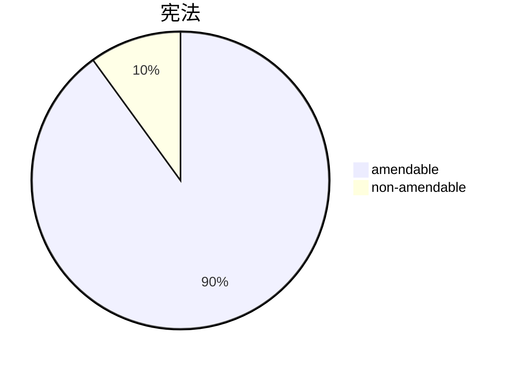

quote 的 د 日子 - "there is no excuse for not trying" - obama
if 你 do 不 學習 , 你 变得 a [[dinosaur]]

老師説-
- don't waste 你 brain 力 on facts 里 这 [[test 考试]] ! 帝国
terms
a13= article 13
caa - 宪法 amendment 行为
土地 - land
ca = constituent assembly
prl - parliament

- [[a368 力 的 prl to amend د 宪法 和 procedure therefor]]

- article 13
- ![[pasted image 20210701133037.png]]
- phrase-
		- 'to د extent 的 such inconsistency' [[unix philosophy#^1b5b74]] = 意思 是 remove 只 those parts 那 是 bad, damaged, do 不 disturb د parts that are alright

- [[doctrine of severability]]
	- 意思 - a 法 是 void to د extent 的 inconsistency 或 contravention 跟 د [[fundamental rights]] acc to [[a13 Laws inconsistent with or in derogation of the fundamental rights]] 的 د 宪法
	-  د above provision 意思 那 行为 may 不 be void as a 全, only a part 的 它 may be void 和  if 那 part 是 separable من  د  rest 哪  是 valid 和 if  د rest 的 د 部分 may continue to stand on its own 和 remain operative,  د rest 的 د 法 should not be held void by د 法院, this doctrine 给 by د [[supreme court]] 的 [[india]] 叫 - doctrine of severability 
	- [[data]] remove only those files which are infected, since files are independent, removal 不 会 affect د operations 的 د 其他 files 里 د 制度
- [[instrumentality 的 state]]

 # *textual form 的 [[a13 法 inconsistent 跟 或 里 derogation 的 د fr]] יככירק'ןו 'קראטןםךלחיעכגזסבהנמצ' *

13. (l) all laws in force in territory ot indra imrn«diatelv of this constitution,

in so far as they are inconsistent with provisions of this
part, shall, to extent of such void.

(2) state shall not make any law which takes away or abridges rights conferred by this part & any law made in contravention of this clause shall, to extent of contravention, void.

(3) in this article, unless context otherwise requires,—

(a) "law" includes any ordinance. order. bye-law,rule, regulation, notification, *custom* or usage having in territory of india force of law;

(b) "laws in force" includes laws passæd or made a legislature or other competent authority in territory of india commencement of this constitution & not previously repealed, notwithstanding that any such law or any part may not then in either at all or in particular areas.

---

# cases related to article 13 (1)
- shankari prasad v/s union 的 印度 (ui), 1951
- sajjan singh v/s state 的 raj [[1965]]
- golaknath v/s state 的 [[punjab]] 1967
- keshavananda bharati v/s state 的 [[kerala]] 1973
- minerva mills v/s state of india 1980

# 01 shankari prasad v/s union 的 印度 (ui), 1951
- zamindari abolition acts
- tenancy control 和 regulation acts
- land ceiling act
- 都 were 分 的 土地 reform (改革) agenda
- rich 人 开 appr 法院 to oppose on ground 的 [[a31 compulsory acquisition of property]] (at that time it 过 a funda right)
- introduced [[1 caa]] - 31a, 31b [[a31a saving 的 法 providing 为 acquisition 的 estates, etc]], [[a31b]]
		- any 法 made 为 د purpose 的 土地 reforms would not be 开 to challenge _ [[a13 法 inconsistent 跟 或 里 derogation 的 د fr]] 的 د 宪法
		- [[a31 compulsory acquisition of property]]

- ![[pasted image 20210701142534.png]]
-  د 战斗 had been won 但 不 د  war !

# 02 sajjan singh v/s state 的 raj [[1965]]
- 知 更 - https://indiankanoon.org/doc/1308308/
- 5 judge bench
- judgement - 3:2 (2 were 反 د  caa 里 这 case)
- 1 的 د dissenting judges - [[justice hidayatullah]] later went on to become chief justice of 印度 ---> [[golaknath case]]
- another dissenter 过 - [[justice mudholkar]] --> [[kesavananda bharati case]]

# 03 [[golaknath case]] 1967
- 11 judge bench
- verdict = 6:5 (6 里 favor 和 5 反)
- this time 大法官 sc, 说-
		- caa= law !! (earlier 2 cases wasn't !!!)
- caa 能 also be challenged _ [[a13 法 inconsistent 跟 或 里 derogation 的 د fr]] (2) [[a13(2)]]

- prl 有 二 kinda力 -
	- constituent 力 ---> 能 make caa
	- ordinary legislative 力 ---> ordinary 法

- 大法官 给 a strict interpretation to [[a368 力 的 prl to amend د 宪法 和 procedure therefor]] 里 [[golaknath case]]
- fr 是 above 都, 所以  不 能  amended
- [[concept 的 prospective overruling]] -judgements would only be applicable prospectively ie from now on past rulings cannot be changed
- story 的 力 tussle 中 د prl 和 د [[judiciary]]

# 24th caa, 1971
<iframe src="https://docs.google.com/spreadsheets/d/1dwwqgeyhy1yqt8uczerxsxwquz6hnmhwuxk6ovy2uv0/edit#gid=0" width="500" height="500" ></iframe>

- 历史 background - [[indira gandhi]] emergency
- added [[a13(4)]] 里 宪法
- (4) nothing in 这 article shall apply to any amendment of this 宪法 made under [[a368 力 的 prl to amend د 宪法 和 procedure therefor|a368]].]
- added [[a368(3)]]
- basically 说, these 二art 不 会 applicable to each 其他 hahahahaha lol rofl, wow tussle 为 力
-  它 过 challenged 里 大法官 里 [[kesavananda bharati case]]

# 04 keshavananda bharati کیسوانند بھاراتی v/s state 的 [[kerala]] 1973
- کیسوانند بھاراتی
- *[[nani palkiwala]]* - lawyer who 过 on د side 的 petitioner, 最多 famous lawyer 的 印度
- 13 judge bench
- verdict - 7:6 ---> 7+6= 13 (recursion to 第二 point)
- [[justice hr khanna]] - 1 的 د judges who 给 judgment 反 this, 他 过 ignored 为 justice appointment 因为  spoke 反  د ruling 政府 [[indira gandhi]] [[caesar]] [[emperor ♔♕♚]]
- [[justice hr khanna]] resigned من [[judiciary]]
- 里 这 case, د 大法官 sc overturned د judgment 的 *sajjan singh 和 shankari prasad case*, د opinion 的 د 法院 过 based on د dissenting judgments 的 [[justice hidayatullah]] 里 `sajjan singh case`, 它 过 held 被 د 法院 那 [[fundamental rights]] 是 transcendental 里 nature 和 不 be amended 被 د prl 里 any way whatsoever
- [[doctrine 的 harmonious construction]]
- [[directive principles of state policy]]
- 法院 说 - a13(a) 和 a368(3) 是 unconstitutional
- [[justice mudholkar]]

- non-amendable 分= basic str 的 د 宪法 ---> kernel 的 د [[os operating 制度]]
- [[doctrine of basic structure of the constitution]]- some 分 的 د 宪法 不 是 amended, ie 他们 是 unamendable
- [[doctrine 的 implied limitation]] - there 是 implied 和 inherent limitation on د 力s 的 prl to amend د 宪法 
- [[fundamental rights]] 能 amended, to [[doctrine of basic structure of the constitution]]

doctrine of basic structure
1. supremacy of constitution
2. rule of law
3.separation of powers
4. federalism
5. secularism
6. judicial review
7. parliamentary democracy
8. republican form of govt
9. judicial independence
10. unity & integrity of nation

- critical analysis of doctrine of basic structure
	- no constitutional basis
	- tyranny of unelected
	- violates separation of powers
	- 很 subjective

- pro points
	- seeks to preserve basic constitutional identity
	- been applied 很 sparingly by courts
	- some other constitutions have also adopted this doctrine

- 这 case 是 supposed to 有 saved 民主 里 印度 ! من د tyranny 的 د prl

# assignment
citing supreme court judgment in relevant cases, discuss power of parliament to amend fundamental rights. [10 marks,150 words]. (assignment code- 34340)