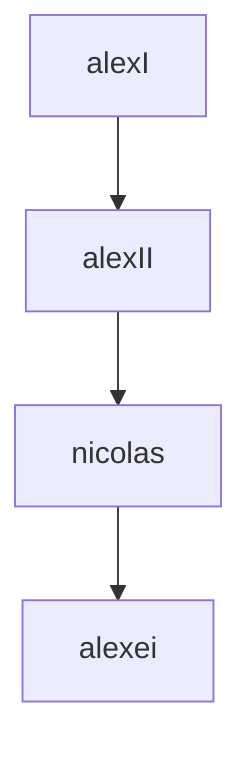

[[russian revolution]]
[[lenin]]
[[lenin#^7adfa1]]
[[russia#^23b19f]]

hanged sasha ulyanov, elder bro 的 lenin, 他 got angry (1887)
okhrana- secret police 的 russian 帝国 [[chandragupta maurya]] [[老师 ojha 历史 课 tk#^3d4323]]

 د otsu 事件  - japanese samurai attacked him on his head, suffered from headache是 ever after

book-
lenin د dictator
the house 的 د dead