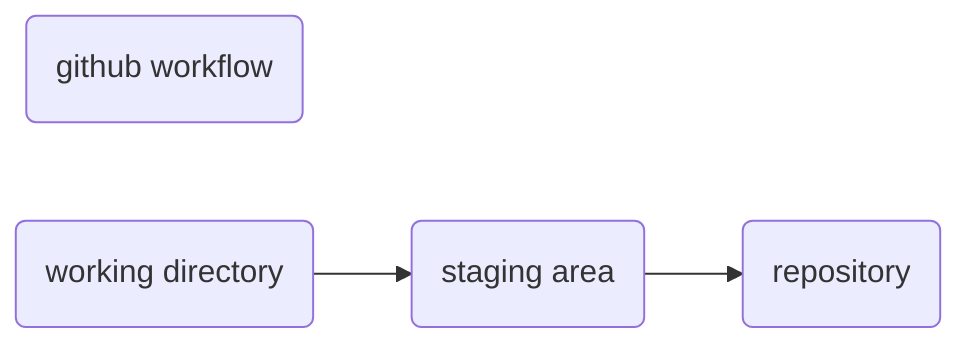

- [[]]
table of content
```toc
```


- [[2022-07-23]] 23:14
git remote add origin "paste ssh link here"
git push origin master

- [[2022-07-17]] 12:38
#pneumonic = wsr
working directory
staging area
repository


- ls -a OR la = list all files
- rm = to remove file
- rm -rf = to remove folder
- git status = gives information on the current status of a git repository and its content.
- git init = creates a new git repository (we run it one time per project)
- [Git](https://git-scm.com/)
- git add = to stage changes to be committed.
- git commit = add commits from the staging area
	- git commit -m "my message"
- git log = to see a log of all the commits made.
- [git add .] = to stage all changes at once.
